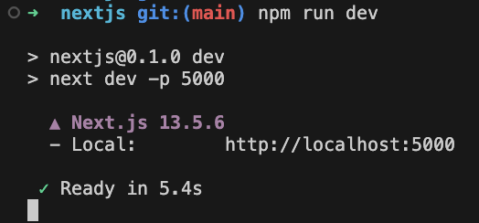

### nextjs 프로젝스 생성 {#toc1}

nextjs 프로젝트 생성 과정

- Node.js 설치
- create-next-app 명령어를 사용하여 자동 프로젝트 생성

#### Nodejs 설치

1. Node.js 설치를 위해 아래의 이미지를 클릭 :arrow_down:
2. 최신 LST (Long Term Service) 버전 다운로드 진행

[](https://nodejs.org/en)

#### create-next-app 명령어를 사용하여 자동 프로젝트 생성

아래의 명령어를 터미널에 입력하여 프로젝스 생성 시작

```js
//아래의 명령어를 입력하면 몇가지 프로젝트 생성에 필요한 추가 정보를 선택할 수 있게 된다.
npx create-next-app@latest
```

아래는 프로젝트 생성 관련 설정 질문 내용입니다.

- 제가 추천하는 설정을 공유 합니다.

```js
// 프로젝트 이름 (Ex. yourProjectName)
What is your project named? yourProjectName
// 타입스크립트 사용을 추천 Yes
Would you like to use TypeScript? Yes
// ESLint 는 무조건 사용을 추천 Yes
Would you like to use ESLint? Yes
// Tailwind 는 저는 제대로 사용해보지 않아서 본인의 선택
Would you like to use Tailwind CSS? No / Yes
// src 폴더 사용을 추천 Yes
Would you like to use `src/` directory? Yes
// App Router 사용을 추천
Would you like to use App Router? (recommended) Yes
// import alias 는 사용하지 않는것을 추천. No
Would you like to customize the default import alias (@/ *)? No
// No를 하면 아래의 질문은 Skip 됩니다.
What import alias would you like configured? @/*
```

- Ex. Window 명령 Prompt 에서 설치시 아래와 같은 형태로 진행됩니다.


### 서버 실행 #{toc2}

터미널에 아래의 명령어를 실행하면 서버가 실행 됩니다.

```js
npm run dev
```

- 정상 동작시 결과 스크린샷
- 기본 포트는 3000 입니다. 스크린샷은 5000 포트



- 간단한 설치 후 nextjs 프로젝트 생성 및 서버 실행까지 알아보았습니다.
- 다음은 서버 포트 변경에 대한 내용에 대하여 알아보고자 합니다.
- :arrow_right: [nextjs 서버 포트 변경](https://marindie.github.io/nextjs/2023-12-14-Nextjs-Tutorial-02-KR)

[^1]: This is a footnote.

[kramdown]: https://kramdown.gettalong.org/
[My Blog]: https://marindie.github.io
